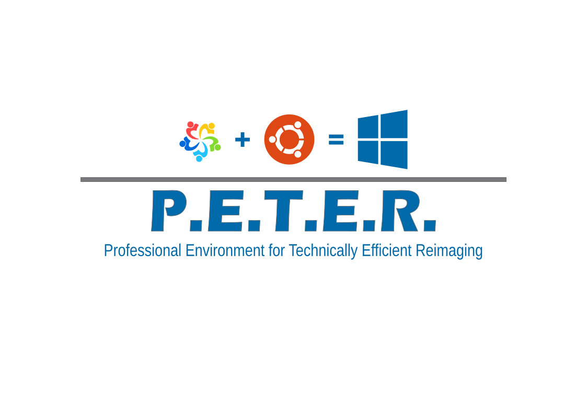
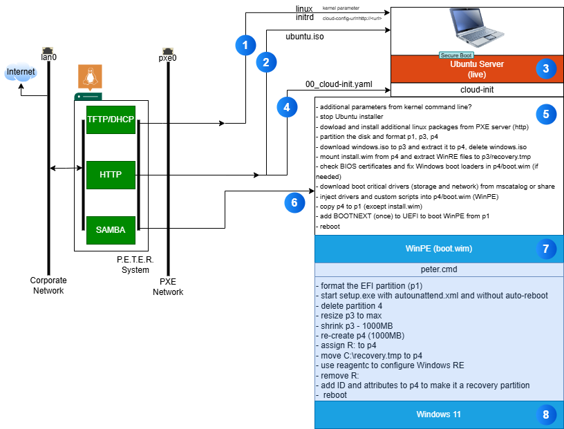
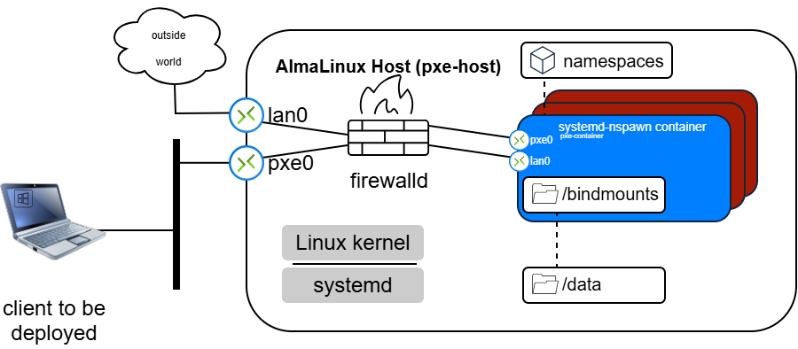

# P.E.T.E.R. Professional Environment for Technically Efficient Reimaging


<table style="border-collapse: collapse; width: 100%;">
  <thead>
    <tr>
      <th style="text-align: left; vertical-align: top; border: 1px solid #ccc; padding: 2px;">
        <b>FUNCTION</b>
      </th>
      <th style="text-align: left; vertical-align: top; border: 1px solid #ccc; padding: 2px;"></th>
    </tr>
  </thead>
  <tbody>
    <tr>
      <td valign="top">
        <b>P.E.T.E.R.</b> will do a fully automated install of Win 11 using <b>Linux</b> in under 20 minutes:<br><br>- Secure Boot<br>- partition target disk<br>- download drivers from Microsoft Catalog and cache them<br>- inject drivers<br>- fix Win boot loaders if UEFI already has new MS keys
      </td>
      <td valign="top">
        
      </td>
    </tr>
  </tbody>
</table>

**Demo: a full installation of Windows 11 in 20 minutes**

<a href="https://youtu.be/59mnLVbViOk" target="_blank">
 
 <br>Watch full video
</a>
<br><br>

The [documentation](https://rawcdn.githack.com/derpcfreak/P.E.T.E.R./0217695f2d2ead9225d97cdd99c5923b329a18ae/docs/P.E.T.E.R.html) (a TiddlyWiki) is part of this repository and you can show/use it directly in your browser by [clicking here](https://rawcdn.githack.com/derpcfreak/P.E.T.E.R./0217695f2d2ead9225d97cdd99c5923b329a18ae/docs/P.E.T.E.R.html).<br>
The source of the docs is stored in [docs](docs).

**Below is a visualization of the pxe setup process:**



The host where **P.E.T.E.R.** is running in principal looks like this,  a Linux host running AlmaLinux where the entire PXE-Boot-System runs inside a **systemd-nspawn container**.



# Fast Start

## Install a machine with Almalinux

Use a computer with 2 network cards (1 connected to your LAN, the second not connected to a network) and an AlmaLinux 10.x installation media. When you see the GRUB menu, add the following at the end of the kernel command line:

```
inst.ks=http://sc.pcfreak.de/peter-ks-prod
```

So for example the original command line would look like:

```
linuxefi /images/pxeboot/vmlinuz inst.stage2=hd:LABEL=AlmaLinux-10-1-x86_64-dvd quiet
```

then after your modification it should show:

```
linuxefi /images/pxeboot/vmlinuz inst.stage2=hd:LABEL=AlmaLinux-10-1-x86_64-dvd quiet inst.ks=http://sc.pcfreak.de/peter-ks-prod
```

Then press **F10** or **Ctrl-x** to install with the modified parameters.

The install script will automatically detect your network cards and name the connected one `lan0` and the disconnected one `pxe0`.

## Create the systemd-nspawn container

SSH into your new installation with the user `pxeadm` and the password `IamtheSysadmin!`. Become root with `sudo -i`.

### Clone this GIT repository

```bash
# as root
cd
git clone https://github.com/derpcfreak/P.E.T.E.R..git
```

### Deploy the systemd-nspawn container

```bash
# as root
cd /root/P.E.T.E.R./container
./000-run-all-bash-scripts.run
```

### place the bindmoount files

```
cd /data
tar -xzvf /root/P.E.T.E.R./bindmounts/data.tar.gz -C /data

cd /data/tuxfiles/
wget https://old-releases.ubuntu.com/releases/24.04/ubuntu-24.04.2-live-server-amd64.iso

cd /data/winfiles/0000-cloud-init
wget 'https://software-static.download.prss.microsoft.com/dbazure/888969d5-f34g-4e03-ac9d-1f9786c66749/26200.6584.250915-1905.25h2_ge_release_svc_refresh_CLIENT_CONSUMER_x64FRE_en-us.iso' -O Win11_25H2_English_x64.iso
#sha256sum Win11_25H2_English_x64.iso
#d141f6030fed50f75e2b03e1eb2e53646c4b21e5386047cb860af5223f102a32  Win11_25H2_English_x64.iso
# other URLs
# https://archive.franscorack.com/file/iso/Windows/Win11-25H2.iso
# https://contents.meetbsd.ir/iso-img/Windows/Win11_25H2_English_x64.iso
# https://lukesau.com/downloads/Windows/Win11_25H2_English_x64.iso
# https://cdn.jordanlindsay.com.au/ISOs/Win11_25H2_English_x64.iso

adminuser='1000'
chown -R root:${adminuser} /data
chmod -R 0775 /data
```

## Start and enable autostart for the container

```
machinectl start pxe-container
machinectl enable pxe-container
```

# Install a client

Connect a client to the `pxe0` interface and initiate a network boot. (System requirements client side: UEFI boot, 8GB RAM).


The full documentation can be found [here](https://rawcdn.githack.com/derpcfreak/P.E.T.E.R./0217695f2d2ead9225d97cdd99c5923b329a18ae/docs/P.E.T.E.R.html) (a TiddlyWiki) is part of this repository and you can show/use it directly in your browser by [clicking here](https://rawcdn.githack.com/derpcfreak/P.E.T.E.R./0217695f2d2ead9225d97cdd99c5923b329a18ae/docs/P.E.T.E.R.html).<br>

